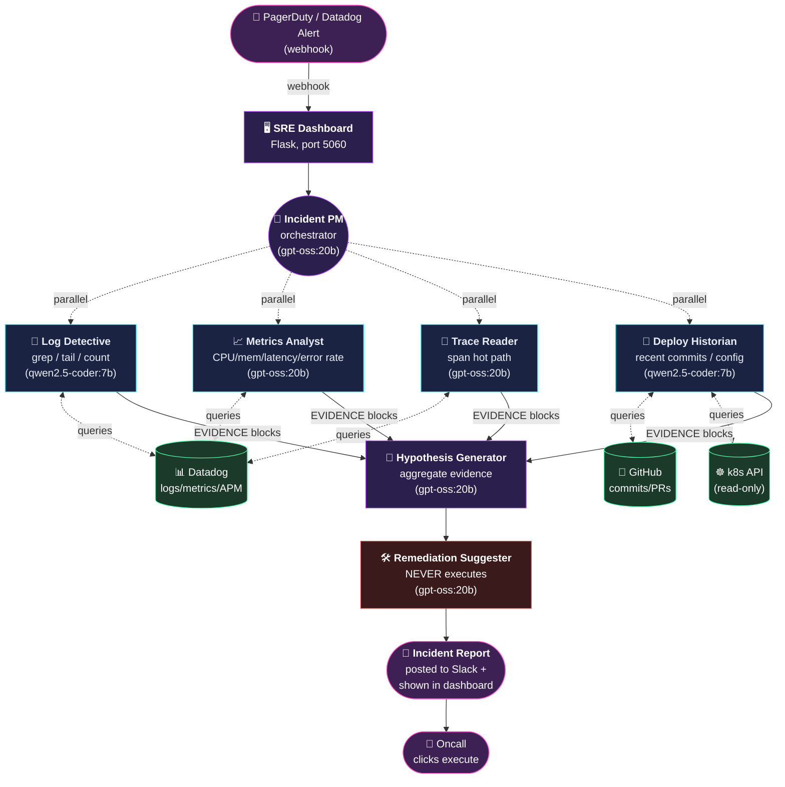
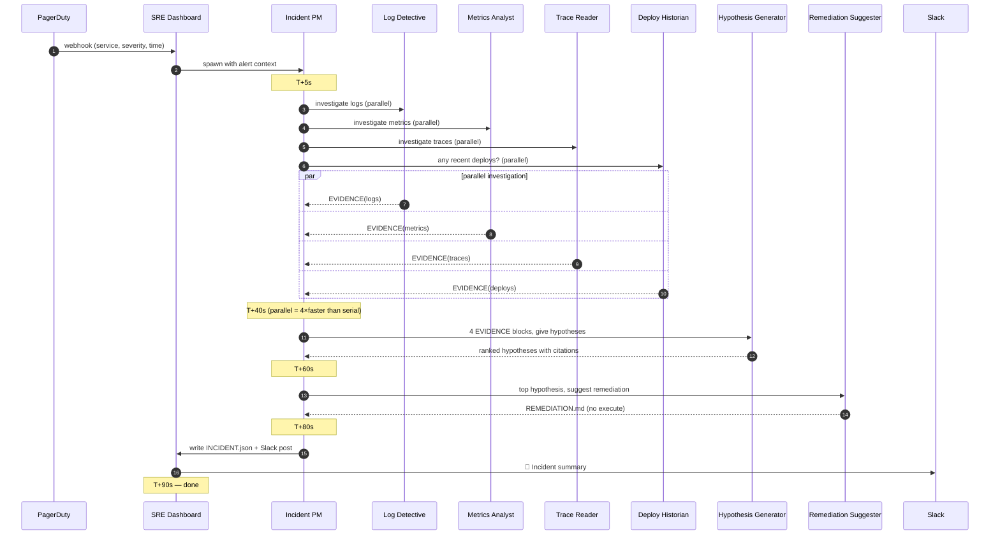

# SRE Agent System — v0 Design

> A multi-agent on-call assistant. When an alert fires, the system automatically
> investigates across logs, metrics, traces, and recent deploys, then proposes
> a remediation — **never executes one in v0**.
>
> Designed by reusing every pattern from our `boss-company`:
> Hub-and-spoke orchestration, lane discipline, structural EVIDENCE gates,
> trust-but-verify, and watchdog fallbacks.

---

## 1. Problem we solve

Modern SRE pain (real numbers from public reports):

| Pain | Cost |
|---|---|
| Mean time to detect (MTTD) | 5-15 min (good teams) |
| **Mean time to diagnose (MTTI)** | **30-120 min** (the bottleneck) |
| Mean time to recover (MTTR) | 15-60 min (after diagnosis) |
| Avg cost of a major incident at a $1B SaaS | $300k-$3M per hour |
| 3-AM oncall calls per engineer per quarter | 4-12 |

> **80% of incident time is spent on diagnosis, not on the fix.**
> Diagnosis is the perfect job for AI: it's reading text (logs / traces / commits)
> and pattern matching. That's exactly what LLMs do well.

Our v0 takes a fresh PagerDuty alert and within **60-90 seconds** produces:

1. A ranked list of likely root causes
2. The exact log lines / trace IDs / metrics graphs that support each hypothesis
3. A suggested remediation (rollback / scale / restart / config change)
4. A 1-paragraph summary the oncall can paste into the incident channel

The human still clicks "execute" — but they save ~30 minutes of grep-the-dashboard work.

---

## 2. Why multi-agent (vs. single GPT-4o call)

Single-agent fails because:

| Problem | Why it kills a single Agent |
|---|---|
| 5 data sources (logs / metrics / traces / deploys / topology) | Each has a different API and a different "what to look for" prompt |
| Latency: 60s SLA | 5 sources × 10s each = 50s sequential — too slow without parallelism |
| Different trust levels | Log Detective can read PII; Remediation Suggester must NOT |
| Hallucinated tool calls | Single agent fabricates log lines it never read. Critical in incidents. |
| Different model tiers | Triage = cheap small model; Hypothesis = needs Claude/GPT-4o |

A 5-agent system fixes all 5 by **specialization + parallelism + lane discipline**.

---

## 3. Architecture



### Agent roster

| # | Agent | Model | Allowed reads | Allowed writes | Forbidden |
|---|---|---|---|---|---|
| 1 | **Incident PM** | `gpt-oss:20b` | INCIDENT.json | INCIDENT.json, STATUS.json | code, k8s, executing anything |
| 2 | **Log Detective** | `qwen2.5-coder:7b` | Datadog logs API | `findings/logs.md` | metrics, traces |
| 3 | **Metrics Analyst** | `gpt-oss:20b` | Datadog metrics API | `findings/metrics.md` | logs (could be PII) |
| 4 | **Trace Reader** | `gpt-oss:20b` | Datadog APM API | `findings/traces.md` | code |
| 5 | **Deploy Historian** | `qwen2.5-coder:7b` | GitHub API, kubectl get | `findings/deploys.md` | kubectl write |
| 6 | **Hypothesis Generator** | `gpt-oss:20b` | all `findings/*` | `HYPOTHESES.md` | data source APIs (no fresh queries) |
| 7 | **Remediation Suggester** | `gpt-oss:20b` | HYPOTHESES.md | `REMEDIATION.md` | **anything that mutates state** |

**Why "Remediation Suggester" has zero write access to production**:
> v0 is a **read-only diagnostic**. Action is human-in-the-loop. The agent
> writes a markdown file the human reads. This is the strictest possible
> lane discipline — and it makes the whole system safe to ship to a real
> oncall rotation on day 1.

---

## 4. The EVIDENCE block — our anti-hallucination contract

Every worker reply ends with this structured block. The PM and Hypothesis Generator only trust what's inside it.

```
<EVIDENCE source="datadog-logs">
  <QUERY>service:checkout-api status:error @http.status_code:500 within 30m</QUERY>
  <HITS>1247</HITS>
  <FIRST_AT>2026-05-11T03:42:17Z</FIRST_AT>
  <PEAK_AT>2026-05-11T03:48:00Z</PEAK_AT>
  <TOP_MESSAGE count=983>"ConnectionPoolTimeout: timed out waiting for a connection (pool size: 10)"</TOP_MESSAGE>
  <TOP_MESSAGE count=201>"redis.exceptions.ConnectionError: Error connecting to redis-prod-2.cache.svc"</TOP_MESSAGE>
  <CITATIONS>
    log_id:AwAAAYj... at 03:48:23
    log_id:AwAAAYj... at 03:48:31
  </CITATIONS>
</EVIDENCE>
<RESULT>FOUND</RESULT>
```

**Why this works** (lessons from the boss-company):

- `<HITS>` is a number — the LLM can't fudge it
- `<CITATIONS>` are real Datadog log IDs the PM can re-query
- `<RESULT>FOUND|NO_SIGNAL|ERROR</RESULT>` is the only thing the PM uses to branch
- If a worker replies without an EVIDENCE block → **rejected, retry** (structural gate)

This is exactly the QA `<EXIT=N>` / DevOps `<HTTP=200>` pattern from our boss company.

---

## 5. End-to-end timeline

Goal: **alert in → human-readable diagnosis out in < 90 seconds**.



---

## 6. UI — the SRE Dashboard

Reuses the cyberpunk theme from boss-dashboard. Three columns:

```
┌─────────────────────── SRE COMMAND CENTER ──────────────────────┐
│ ALERTS: 3 active │ AGENTS: 6 busy │ MTTI today: 1m 12s ✓        │
├──────────────────┬───────────────────────────┬──────────────────┤
│ ACTIVE ALERTS    │ INCIDENT DETAIL           │ AGENT LIVE LOG   │
│                  │   svc: checkout-api       │ [LD] querying DD │
│ ⚠️ checkout-api  │   severity: SEV-2          │ [LD] 1247 hits  │
│   500 spike      │   started: 03:42 UTC       │ [MA] cpu normal  │
│   ↑ investigating│                            │ [TR] slow span:  │
│                  │ EVIDENCE TABS:             │      redis 8.4s  │
│ ⚠️ search-api    │  [Logs] [Metrics] [Traces] │ [DH] deploy 12m  │
│   p99 latency    │  [Deploys]                 │      ago: PR#4421│
│   ✓ resolved     │                            │ [HG] hypothesis: │
│                  │ HYPOTHESES:                │      redis exhaust│
│ INFO incidents   │  ① Redis pool exhaustion   │ [RS] suggesting  │
│ • payment-api    │     (4 evidence, conf 87%) │      rollback... │
│                  │  ② upstream timeout chain  │                  │
│                  │     (2 evidence, conf 31%) │                  │
│                  │                            │                  │
│                  │ SUGGESTED REMEDIATION:     │                  │
│                  │  ▷ Rollback to v2.3.1      │                  │
│                  │    (deployed 30m before)   │                  │
│                  │  ▷ Verify Redis pool size  │                  │
│                  │  ▷ Scale connection pool   │                  │
│                  │                            │                  │
│                  │ [ POST TO SLACK ]          │                  │
│                  │ [ MARK FALSE POSITIVE ]    │                  │
└──────────────────┴───────────────────────────┴──────────────────┘
```

---

## 7. Roadmap

| Phase | What | When |
|---|---|---|
| **v0** (this session) | Scaffold + personas + dashboard + mock data demo | Tonight |
| **v0.5** | Real Datadog MCP integration (read-only), drop-in for mocks | +1 day |
| **v1** | PagerDuty webhook, Slack integration, persistence | +1 week |
| **v1.5** | Eval golden dataset (10 past real incidents, measure success rate) | +2 weeks |
| **v2** | k8s read-only context, GitHub deploy correlation | +1 month |
| **v3** | Optional auto-remediation (rollback/scale only, with kill-switch) | +3 months |

---

## 8. Success metrics

What we measure to know if it works:

| Metric | Target v0 | Target v1 |
|---|---|---|
| **Diagnosis latency p50** | < 90s | < 60s |
| **Diagnosis latency p95** | < 180s | < 90s |
| **Top hypothesis correct on real incidents** | 50% | 70% |
| **% of incidents where remediation suggestion is useful** | 30% | 60% |
| **False positive rate (alert that wasn't an incident)** | < 20% (we say "no signal") | < 10% |
| **Cost per incident** | < $0.10 (mostly local) | < $0.20 |

**The bar to ship**: 50% top-hypothesis-correct + diagnosis in < 90s. At 50% correct,
oncall already saves time because they don't have to start from zero.

---

## 9. What we are explicitly NOT building

| Won't do | Why |
|---|---|
| Auto-remediation | v0 = trust, v3 maybe. Wrong action in prod is worse than late diagnosis. |
| Anomaly detection from raw metrics | Datadog already does this. We consume their alerts. |
| Generic chat with logs | Honeycomb/Coralogix do this. Our angle is **alert → action**. |
| Multi-tenant SaaS | Single-team internal tool first. SaaS is v3+. |
| Mobile UI | Oncall is at a laptop. |

---

## 10. Open questions (need user input later)

1. **Datadog org**: which one to test against? (need API key for v0.5)
2. **Slack workspace**: where to post incident reports? (need webhook for v1)
3. **PagerDuty service**: which service to wire webhook from? (v1)
4. **Eval data**: any past real Datadog incidents I can replay for the eval suite? (v1.5)

For v0 tonight, we don't need answers to any of these. We use mock alerts + canned Datadog responses.
