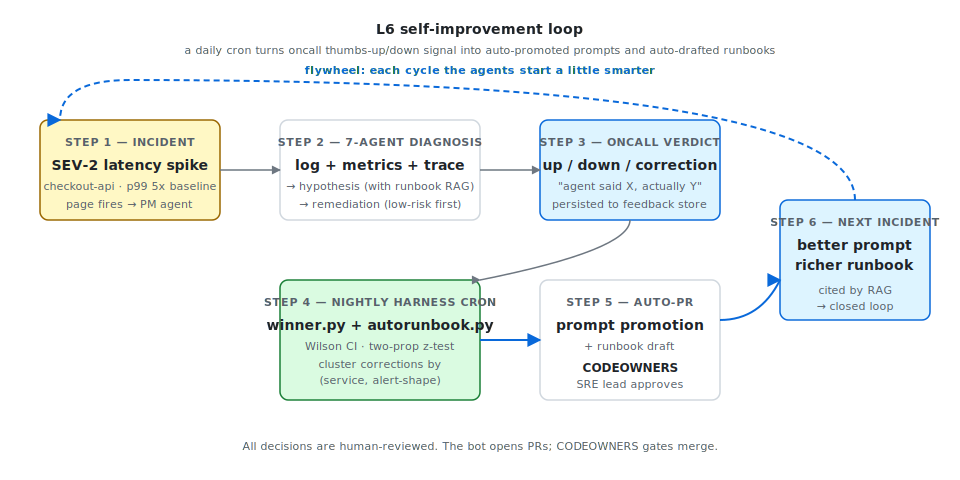

# SRE Agent — Multi-Agent Incident Response

[]()
[](LICENSE)
[]()
[]()
[]()
[]()
[]()
[]()
[]()
[]()
[]()
[]()
[]()
[]()
[]()
[](docs/adr/README.md)

> An AI on-call team. A monitoring alert fires → 7 specialized agents fan out
> across logs / metrics / traces / deploys → a hypothesis generator ranks root
> causes with citations → a remediation suggester writes the fix.
> **The agents never execute remediation.** Diagnosis target: **< 90 seconds**.

<p align="center">
  
</p>

> **The flywheel above is what makes this a system, not a demo.** Every
> incident's oncall verdict feeds a nightly harness cron that auto-promotes
> winning prompt variants and drafts new runbook entries — gated by
> `CODEOWNERS`, not auto-merged.

---

## What this looks like end-to-end

A real auto-generated matrix from `scripts/run-winner-job.py` (3000 synthetic
incidents, `SEED_RNG=42`, 4 prompt variants in flight, `WINNER_MIN_DELTA_PP=3.0`):

```text
### ✅ `hypothesis-gen` — promote
> variant 9a4e2b73 beats 0c8f14d5 by +7.0pp at p=0.001 (n=607 vs 1658)

### ✅ `metrics-analyst` — promote
> variant 6ec88011 beats 7f2d4e10 by +7.2pp at p=0.001 (n=599 vs 1666)

### ⏸ `log-detective` — hold
> not significant at alpha=0.05 (p=0.056, z=+1.91) — collect more data

### ⏸ `remediation-sug` — hold
> not significant at alpha=0.05 (p=0.081, z=+1.75) — collect more data

### ⏸ `deploy-historian` — hold
> only one prompt variant has feedback — A/B not running

### ⏸ `trace-reader` — hold
> only one prompt variant has feedback — A/B not running
```

Two variants get auto-PR'd (with the report as the PR body, the
`Auto-promoted prompt variant` checkbox pre-ticked, and `CODEOWNERS`
routing the review to SRE leads). Two were held back honestly — the
point-estimate looks favourable but the data isn't conclusive at
α=0.05. **A flywheel that says "no" is the sign it's actually working.**

Reproduce locally:

```bash
SRE_FEEDBACK_DIR=/tmp/demo/feedback REPORTS_DIR=/tmp/demo/reports \
  SEED_N=3000 SEED_RNG=42 SEED_AB=0.3 \
  BASELINES="hypothesis-gen=0c8f14d5,metrics-analyst=7f2d4e10,log-detective=09c3b1aa,remediation-sug=812a99ee" \
  python scripts/run-winner-job.py
```

---

## ...and "85% sure" actually means 85% (L6.3 calibration)

When the agent says it's 85% confident, that number is uncalibrated by
default — LLMs are systematically over-confident in the upper range. A
single command fits a Pool-Adjacent-Violators isotonic regressor on the
oncall verdict corpus and reduces Expected Calibration Error by 65%:

```text
# Before calibration (raw LLM confidence vs actual oncall thumbs-up)
| bin           |   N | mean_pred | frac_correct |    gap |
|---------------|-----|-----------|--------------|--------|
| [0.70, 0.80) | 450 |     0.754 |        0.731 |  +2.3pp |
| [0.80, 0.90) | 445 |     0.843 |        0.762 |  +8.1pp |  ← over-confident
| [0.90, 1.00) | 196 |     0.923 |        0.827 |  +9.6pp |  ← over-confident

# After applying the fitted isotonic calibrator
| bin           |    N | mean_pred | frac_correct |   gap |
|---------------|------|-----------|--------------|-------|
| [0.70, 0.80) | 1048 |     0.736 |        0.725 | +1.1pp |
| [0.80, 0.90) |  215 |     0.833 |        0.828 | +0.5pp |  ← well-calibrated
| [0.90, 1.00) |   17 |     1.000 |        0.882 | +11.8pp |

ECE:   0.055 -> 0.019   (65% reduction)
Brier: 0.195 -> 0.191
```

The calibrator is a small JSON file (a step function with a handful of
breakpoints). The dashboard loads it at boot via
`SRE_CALIBRATOR_PATH` and applies it before showing any confidence
number to oncall. Missing artifact is safe — the loader returns the
identity calibrator (no-op).

```bash
sre-agent calibrate --out data/calibrator.json --out-md reports/calibration.md
sre-agent calibrate-show         # inspect what's loaded
curl http://localhost:5080/api/harness/calibration | jq
```

---

## What's new (Q2 release — D1 / D4 / G2 / E1 / J1 / K2 / K5)

The previous release made the system observable and self-correcting.
This release makes it **defensible**: real backends, real paging,
better LLM accuracy, more golden cases, and the engineering hygiene
that gates the whole thing.

| Code | Capability | Where it lives |
| ---- | ---------- | -------------- |
| **D1** | Real Prometheus + Loki provider hardening: `health()`, retry-with-backoff (3 attempts, 429/5xx + transient network errors), bearer/basic auth, Prometheus self-metrics for every backend call. | `src/sre_agent/providers/_http.py`, `src/sre_agent/providers/{prometheus,loki}.py` |
| **D4** | PagerDuty Events API v2 notifier: trigger / acknowledge / resolve, severity gating (`PAGERDUTY_MIN_SEVERITY`), dry-run when no routing key, auto-page hook on diagnosed SEV-1/2 (`SRE_PAGERDUTY_AUTO_PAGE=on`), self-metrics. | `src/sre_agent/notifications/pagerduty.py`, `dashboard/app.py:/api/incidents/<id>/page` |
| **G2** | Self-consistency LLM ensemble (Wang et al. 2022): K parallel `hypothesis_generator` calls via a thread-pool helper, picks the highest-confidence answer, records ensemble agreement as `sre_ensemble_agreement`. Opt-in via `SRE_HYPOTHESIS_ENSEMBLE_K=3`. | `src/sre_agent/concurrency.py`, `src/sre_agent/nodes/hypothesis_gen.py` |
| **E1** | Golden eval suite expanded from 3 to 10 hand-curated cases covering 8 distinct failure shapes (Redis pool, downstream cascade, false-positive, disk-full, DNS, memory leak, cert expiry, slow DB, AZ partition, rate-limit). 7 are LLM-gated; 3 run in fallback-only CI. | `tests/eval/cases/`, `mocks/scenarios.json` |
| **J1** | 7 Architecture Decision Records (LangGraph orchestration, SQLite-vs-Postgres, BM25-no-vector-DB, fallback chain, synthetic data, no-auto-execute, ensemble-via-threads). MADR format. | [`docs/adr/`](docs/adr/README.md) |
| **J2** | "Why we did NOT do X" — short answers to ideas the team has already evaluated and declined. | [`docs/why-not.md`](docs/why-not.md) |
| **K2** | Pre-commit hooks (`ruff format`, `ruff check --fix`, fast pytest subset, file-hygiene). | `.pre-commit-config.yaml` |
| **K5** | CodeQL `security-and-quality` query pack on every PR + weekly cron, plus Dependabot for Python / GitHub Actions / Docker with grouped weekly PRs. | `.github/workflows/codeql.yml`, `.github/dependabot.yml` |

Total tests: **447 passing** (up from 396).

## Production hardening (the boring, important parts)

Below are the four capabilities that turn this from "a demo with a flywheel"
into something you can put behind a Prometheus alert rule.

### Prometheus metrics (`/metrics`)

Every counter you'd want to alert on, exposed in standard text format:

```text
# HELP sre_incidents_total Number of incidents seen by the agent, by terminal phase.
# TYPE sre_incidents_total counter
sre_incidents_total{result="diagnosed"} 142
sre_incidents_total{result="no_signal"} 8
sre_incidents_total{result="error"}     2

# HELP sre_llm_latency_seconds LLM call wall-time, in seconds.
# TYPE sre_llm_latency_seconds histogram
sre_llm_latency_seconds_bucket{agent="hypothesis-gen",model="gpt-oss:20b",le="10.0"} 134
...

# HELP sre_llm_fallbacks_total B4 fallback transitions, by agent and the (from, to) tier pair.
sre_llm_fallbacks_total{agent="chain.orchestrator",from_tier="primary",to_tier="cheap",reason="timeout"} 6

# HELP sre_calibrator_ece Expected Calibration Error of the currently-loaded calibrator (training set).
# TYPE sre_calibrator_ece gauge
sre_calibrator_ece 0.019
```

Use the example alert rules in [`docs/ops-runbook.md`](docs/ops-runbook.md)
or wire your own. The metric set is intentionally low-cardinality —
no per-incident labels, ever.

### 3-tier LLM fallback (`SRE_LLM_FALLBACK=on`)

Every LLM call goes through `primary → local-ollama → rule-based-degraded`,
with per-tier timeouts enforced in a worker thread. Each transition
records:

  * a typed `LLMCallRecord(kind="fallback")` in the harness ring buffer
    (post-mortem visibility), and
  * a `sre_llm_fallbacks_total` counter tick (alert visibility).

The rule-based tier is a 0-latency safety net: it returns a
schema-valid but explicitly low-confidence response so the pipeline
finishes even when every LLM provider is down.

### Persistent BM25 runbook index

Cold-boot used to mean re-embedding every runbook chunk. On a 500-chunk
prod library with OpenAI embeddings that's a 6-minute boot. Now:

```bash
sre-agent runbook-index --output data/runbook-index.json --backend bm25
# 39kb file, builds in <1s for 15 chunks
```

```bash
# At runtime, set the env var. The store loads in O(n_chunks), not
# O(n_chunks * embedding_latency).
export SRE_RUNBOOK_INDEX_PATH=$(pwd)/data/runbook-index.json
```

BM25 (Lucene defaults: `k1=1.2`, `b=0.75`) beats the previous
TF-IDF-cosine on precision-at-1 because it understands term saturation
and document length — table-stakes for ranked retrieval.

### Calibration auto-PR cron (3rd L6 bot)

```yaml
# .github/workflows/harness-calibration.yml
on:
  schedule:
    - cron: "0 4 * * 0"   # weekly, Sunday 04:00 UTC
```

Same template/CODEOWNERS pattern as winner.yml and autorunbook.yml.
Opens a PR touching `data/calibrator.json` **only when** the new
candidate's ECE beats the live calibrator's ECE by ≥3pp (configurable).
Statistical report goes in the PR body via
`PULL_REQUEST_TEMPLATE.md`. Bot PRs look like human PRs.

---

## What changed in v1 (this branch)

v0 was a deterministic demo: agents were "simulated" by a Python script that
pretended to be a multi-agent system. v1 is a real production system:

| Layer | v0 | v1 |
|---|---|---|
| Orchestration | hand-rolled `threading.Thread` | **LangGraph** (parallel fan-out, conditional edges, checkpointing) |
| State | in-memory dict | **SQLite (dev) / Postgres (prod)** checkpointer — survives restarts |
| Model | none (text simulation) | **Ollama / OpenAI / Anthropic** via factory |
| Output | text strings | **Pydantic structured output** — LLM forced to return typed JSON |
| Failure mode | crash | **Graceful degradation** — every node has a rule-based fallback |
| Deploy | python script | **Docker + docker-compose + Postgres** |
| Tests | none | **30 pytest cases** covering schemas, mock provider, full graph, dashboard |

---

## Quick start

### Option A — local dev (no Docker)

```bash
git clone https://github.com/doraemonlyz-jpg/sre-agent.git
cd sre-agent
python -m venv .venv && source .venv/bin/activate
pip install -e ".[dev]"

# Try the CLI
sre-agent scenarios
sre-agent investigate --scenario redis-pool-exhaustion

# Or boot the dashboard
python dashboard/app.py     # http://127.0.0.1:5080
```

### Option B — Docker (production-shaped, with Postgres)

```bash
cp .env.example .env       # add OPENAI_API_KEY or leave blank for Ollama
docker compose up --build  # dashboard at http://localhost:5080
```

### Option C — local LLM (Ollama)

```bash
# Pre-pull the models
ollama pull qwen2.5-coder:7b
ollama pull gpt-oss:20b

# Tell the agent to use Ollama
export SRE_LLM_PROVIDER=ollama
sre-agent investigate --scenario redis-pool-exhaustion
```

### Option D — full open-source demo (Prometheus + Loki + buggy app)

A self-contained world where the agent runs against **real** observability
infrastructure instrumenting a deliberately buggy service. See
[`demo-stack/`](demo-stack/README.md) for the full 60-second recipe.

```bash
# Bring up Prometheus + Loki + Grafana + chaos-app
docker compose -f demo-stack/docker-compose.yml up -d --build

# Point the SRE Agent at it
export SRE_DATA_PROVIDER=oss
export PROMETHEUS_URL=http://localhost:9090
export LOKI_URL=http://localhost:3100
python dashboard/app.py

# In another terminal: generate load until /redis-leak exhausts the
# "pool", then fire a webhook alert
./demo-stack/scripts/generate-load.sh 80
./demo-stack/scripts/fire-alert.sh
```

The dashboard now shows 8 agents fanning out across real Prometheus +
Loki APIs, producing a ranked root-cause hypothesis with confidence and
supporting evidence. **This is the demo to record for an interview.**

---

## Architecture

```
                ┌──────────────┐
                │ incident_pm  │   open incident
                └──────┬───────┘
                       │
        ┌─────────┬────┴────┬─────────┬──────────────┐
        ▼         ▼         ▼         ▼              ▼
   log_detec  metrics_  trace_rdr  deploy_hist  runbook_consult    (parallel)
        │      analyst    │           │              │
        └─────────┴───────┴───────────┴──────────────┘
                              │
                              ▼
                     ┌──────────────────┐
                     │ hypothesis_gen   │   live telemetry + team's runbooks
                     └─────────┬────────┘
                               ▼
                     ┌──────────────────┐
                     │ remediation_sug  │   suggest fix, cite runbook commands
                     └─────────┬────────┘
                               ▼
                     ┌──────────────────┐
                     │     finalize     │   write IncidentReport
                     └──────────────────┘
                               ▼
                              END
```

**Eight agents in three layers:**

1. **`incident_pm`** — opens the incident, emits the kickoff event.
2. **Five parallel workers** —
   - `log_detective` / `metrics_analyst` / `trace_reader` / `deploy_historian`
     gather *live telemetry* from whatever provider you configure
     (mock / Datadog / Prometheus+Loki).
   - **`runbook_consultant`** retrieves *prior knowledge* — the team's
     runbooks (`runbooks/*.md`) via RAG over OpenAI / Ollama / TF-IDF
     embeddings. This is the moat: the agent doesn't reason in a vacuum,
     it brings your team's accumulated knowledge to every incident.
3. **`hypothesis_gen` → `remediation_sug` → `finalize`** — synthesize a
   ranked diagnosis and a safe action plan, citing both telemetry *and*
   the runbook chunks that match the failure mode.

Each node is a small Python function that:

1. Reads typed state from `GraphState` (TypedDict)
2. Optionally calls a `DataProvider` (mock / Datadog / Prometheus / Loki) or the `RunbookStore`
3. Optionally calls an LLM via `.with_structured_output(SomePydanticModel)`
4. Returns a partial dict; LangGraph merges via reducer

The whole pipeline is **checkpointed** — if the dashboard pod crashes mid-incident,
the graph resumes from the last completed node on restart.

See [DESIGN.md](DESIGN.md) for the full architecture.

---

## Layout

```
sre-agent/
├── src/sre_agent/           # the Python package
│   ├── schemas.py            # Pydantic: AlertIn, EvidenceBlock, Hypothesis, …
│   ├── graph.py              # LangGraph wiring
│   ├── state.py              # (see schemas.py — GraphState lives there)
│   ├── nodes/                # one file per agent
│   │   ├── incident_pm.py
│   │   ├── log_detective.py
│   │   ├── metrics_analyst.py
│   │   ├── trace_reader.py
│   │   ├── deploy_historian.py
│   │   ├── runbook_consultant.py     # ← Phase B: the team-knowledge layer
│   │   ├── hypothesis_gen.py
│   │   └── remediation_sug.py
│   ├── runbooks/             # ← Phase B: RAG subsystem
│   │   ├── chunker.py        # markdown → chunks
│   │   ├── embedders.py      # OpenAI / Ollama / TF-IDF backends
│   │   └── store.py          # indexed, service-filtered retrieval
│   ├── providers/
│   │   ├── base.py           # DataProvider ABC
│   │   ├── mock.py           # uses mocks/scenarios.json
│   │   ├── datadog.py        # real Datadog API
│   │   ├── prometheus.py     # metrics-only OSS provider
│   │   ├── loki.py           # logs-only OSS provider
│   │   └── composite.py      # mix-and-match providers per evidence type
│   ├── models/factory.py     # Ollama / OpenAI / Anthropic factory
│   ├── personas.py           # loads personas/*.md as system prompts
│   ├── logging.py            # structlog setup
│   └── cli.py                # `sre-agent ...` Typer CLI
├── personas/                 # 8 agent personas (markdown, used as system prompts)
├── runbooks/                 # ← Phase B: the team brain
│   ├── chaos-app.md          #     one file per service…
│   ├── checkout-api.md       #     …each `## section` becomes one chunk
│   └── general/              #     cross-cutting patterns (cascade, false-positive, …)
├── mocks/scenarios.json      # 3 demo incidents
├── dashboard/                # Flask UI; backend just spawns LangGraph runs
├── tests/                    # pytest, 111 cases, fully offline
├── pyproject.toml
├── Dockerfile
├── docker-compose.yml
└── .env.example
```

---

## Configuration

Every knob is an environment variable. See `.env.example` for the full list.

| Var | Default | Purpose |
|---|---|---|
| `SRE_LLM_PROVIDER` | auto | `openai` / `anthropic` / `ollama` |
| `SRE_LLM_ORCHESTRATOR` | per-provider | model used by PM, Hypothesis, Remediation |
| `SRE_LLM_WORKER` | per-provider | model used by the 4 parallel workers |
| `SRE_DATA_PROVIDER` | `mock` | `mock` reads scenarios.json; `datadog` (v1.1) hits the real API |
| `SRE_CHECKPOINTER` | `sqlite` | `sqlite` (local file) or `postgres` (prod) |
| `DATABASE_URL` | – | Postgres DSN, used when `SRE_CHECKPOINTER=postgres` |
| `SRE_DASHBOARD_PORT` | `5080` | the Flask UI port |

---

## Safety properties

These are enforced by the type system, not by prompts:

| Property | How |
|---|---|
| **Agents never execute remediation** | `RemediationPlan.actions` is a list of `(title, command, reversal)` triples — only shown in UI |
| **Every remediation has a reversal** | Pydantic field required, validated at parse time |
| **Workers cannot hallucinate evidence** | Each `EvidenceResult` is `FOUND` / `NO_SIGNAL` / `ERROR` — typed enum, can't be prose |
| **Citations are typed** | `LogsEvidence.citations: list[str]` of log IDs; PM can re-query |
| **Graph survives restarts** | `SqliteSaver` / `PostgresSaver` checkpoints after every node |
| **LLM failure is graceful** | Every node has a rule-based fallback; tests pin LLM to unreachable host |

---

## Comparison

| Tool | Their angle | Ours |
|---|---|---|
| Resolve.ai ($35M Series A) | SaaS, auto-remediation | Self-hosted, local-first, human-in-the-loop |
| Cleric AI | SRE chat copilot | Webhook-driven pipeline, not chat |
| Datadog Bits AI | inline summaries | cross-tool correlation, structural citations |
| Honeycomb | "ask your logs" | "diagnose this alert end-to-end" |

Unique selling point: **the typed `EvidenceBlock` contract**. Most LLM ops
tools fail because they hallucinate citations. Pydantic schemas + structured
output mean ours physically cannot return a hypothesis without verifiable
log/trace/PR IDs the PM re-checks.

---

## Connecting to your stack

The Provider abstraction supports **Datadog** and a **Prometheus + Loki**
composite out of the box. Webhook ingestion accepts **Datadog Monitor /
PagerDuty / generic JSON** payloads.

| `SRE_DATA_PROVIDER` | logs | metrics | traces | deploys |
|---------------------|:----:|:-------:|:------:|:-------:|
| `mock` (default)    |  ✓   |    ✓    |   ✓    |    ✓    |
| `datadog`           |  ✓   |    ✓    |   ✓    |    ✓    |
| `prometheus`        |  —   |    ✓    |   —    |    —    |
| `loki`              |  ✓   |    —    |   —    |    —    |
| `oss` (prom+loki)   |  ✓   |    ✓    |   —    |    —    |

### Real-data Datadog provider

```bash
export SRE_DATA_PROVIDER=datadog
export DD_API_KEY=...
export DD_APP_KEY=...
export DD_SITE=datadoghq.com       # or datadoghq.eu, us3, ap1, ...
```

Mappings:

| Method            | Datadog endpoint                        |
|-------------------|-----------------------------------------|
| `fetch_logs`      | `POST /api/v2/logs/events/search`       |
| `fetch_metrics`   | `GET  /api/v1/query`   (5 std queries)  |
| `fetch_traces`    | `POST /api/v2/spans/events/search`      |
| `fetch_deploys`   | `GET  /api/v1/events?sources=deploy`    |

Network failures **never** raise — every API error becomes evidence with
`result=ERROR` so the graph keeps running with whatever partial signal it has.

### Inbound alert webhook

`POST /api/alerts/webhook` accepts three payload shapes, auto-detected:

```bash
# Datadog Monitor → Webhooks integration
curl -X POST http://localhost:5080/api/alerts/webhook \
  -H "Content-Type: application/json" \
  -d '{"alert_id":"99","alert_title":"err_rate","priority":"P1",
       "service":"checkout","tags":"env:prod","date":"2026-05-11T14:30:00Z"}'

# PagerDuty Webhook v3
curl -X POST http://localhost:5080/api/alerts/webhook \
  -d '{"event":{"event_type":"incident.triggered","data":{
       "title":"latency spike","service":{"summary":"checkout"},
       "urgency":"high","created_at":"2026-05-11T14:30:00Z"}}}'

# Generic — minimum contract
curl -X POST http://localhost:5080/api/alerts/webhook \
  -d '{"service":"checkout","description":"errors","severity":"high"}'
```

Force a specific adapter with `?source=datadog|pagerduty|generic` or
`X-SRE-Source` header. Set `SRE_WEBHOOK_SECRET` and have the sender include
`X-SRE-Token` to enable shared-secret auth.

### Slack notifications

```bash
export SLACK_WEBHOOK_URL=https://hooks.slack.com/services/...
# or force preview-only:
export SRE_SLACK_DRY_RUN=true
```

`POST /api/incidents/<id>/post-slack` either POSTs Block Kit JSON or returns
a dry-run preview the user can paste manually.

### Runbook RAG (Phase B — the team brain)

Every `*.md` file under `runbooks/` is chunked at startup, embedded, and made
searchable. The `runbook_consultant` agent runs in parallel with the four
telemetry workers and surfaces the top 3 most relevant chunks for each
incident. The hypothesis generator and remediation suggester both consume
those chunks and cite them by file path in their output.

```bash
# Backend auto-detects: OpenAI (if OPENAI_API_KEY) → Ollama → TF-IDF fallback
export SRE_EMBEDDINGS_BACKEND=auto        # 'openai' | 'ollama' | 'keyword'
export SRE_EMBEDDINGS_MODEL=text-embedding-3-small   # optional override
export SRE_RUNBOOKS_DIR=/path/to/runbooks            # default: ./runbooks
```

**Authoring** a runbook is just markdown. Each `## ` heading becomes one
retrievable chunk; optional `> service:` and `> tags:` lines on the first
lines of the section gate it to a specific service. See
[runbooks/README.md](runbooks/README.md) for the full format.

**Why this matters**: without it, the agents are general-purpose SRE
analysts staring at telemetry. With it, they're *your* on-call team —
they've read your service's known failure modes, your team's playbooks,
your incident history. Hypothesis output goes from "errors suggest a
Redis problem" to "this matches the documented connection-pool
exhaustion pattern in `runbooks/checkout-api.md`, mitigation is
`kubectl rollout undo`".

The TF-IDF fallback is intentional: zero dependencies, deterministic,
runs the entire test suite offline. Real embeddings improve recall but
aren't required to demo the system.

---

## Tests

```bash
pytest                       # 111 cases, no network, runs in ~25s
pytest --cov=sre_agent       # coverage report
```

The test suite **does not call any real LLM and never opens a socket**. The
Datadog provider and Slack notifier are exercised against their real response
shapes via `respx` — only the HTTP layer is faked, the parsers are the real
production code.

---

## What's still TODO

- [x] Real Datadog provider (Logs API v2, Metrics v1, APM v2)
- [x] Webhook receiver (Datadog Monitor / PagerDuty / generic)
- [x] Real Slack notifier (Block Kit + dry-run mode)
- [x] Prometheus / Loki providers + open-source demo stack
- [x] Runbook RAG (8th agent — `runbook_consultant`, the team brain)
- [x] **Mocked production-scale**: bounded worker pool, burst endpoint, tier classifier (see Phase E below)
- [x] **Harness L3 / L4**: observability ring buffer, prompt fingerprinting, response cache, retry policy, golden-incident eval (see Harness section below)
- [x] **Harness L5**: auth (bearer + scopes), rate limit, feedback flywheel, prompt A/B, Slack interactive buttons, OpenTelemetry / Langfuse export, drift-detection CLI, k8s deep-readiness probe (see L5 section below)
- [ ] Tempo / Jaeger provider for traces (open-source stack)
- [ ] Per-team multi-tenancy on top of the scope system (today: process-global tokens)
- [ ] Auto-promote thumbs-down + corrected diagnosis to a candidate runbook
- [ ] Live A/B winner detection: cron job comparing per-prompt-SHA score

---

## Phase E — production-scale roadmap (TikTok / hyper-scale)

The system today is **interview-ready** but not yet **TikTok-ready**. The
architectural insight remains: at hyper-scale, *raw* log/metric volume
(tens of millions of lines per minute) never touches the agent — that's
the telemetry backend's job (ByteLog / Datadog / ClickHouse). The agent
calls focused queries (one service, 15-minute window, error filter) and
reasons over the *bucketed* result, which is hundreds, not millions.

The actual bottlenecks at scale, and the planned upgrades:

| Bottleneck | Current state | Phase E upgrade |
|---|---|---|
| **Alert burst** (1000 alerts/min when a hub service dies) | Bounded `ThreadPoolExecutor`, mocked (`SRE_MAX_CONCURRENT=4`) | Webhook → Kafka / RocketMQ; Temporal workers; `_spawn_incident` becomes idempotent on `incident_id` |
| **LLM cost** ($1.5M/yr at 100k alerts/day on GPT-4o) | Three-tier classifier (`rule` / `cheap` / `premium`), mocked routing visible in UI | Real tiered execution: local Llama-3 70B for `cheap`, GPT-4o only for `premium`; per-team budget caps |
| **Telemetry query** (single PromQL pulls 1M points on high-cardinality services) | 5 fixed PromQL queries; no cardinality control | Force `topk` / `sum by (psm)` reducers; recording-rule precompute; adaptive window shrink (30m → 5m → 1m on timeout) |
| **Trace volume** (Bits ingests billions of spans/min) | Datadog APM page-limit 100 | Sampling-aware API; head-based sampled errors only; never query unsampled |
| **Checkpoint storage** (100k incidents/day = single Postgres saturates) | `SqliteSaver` / `PostgresSaver` | Partitioned by region; TiDB / CockroachDB; TTL + cold-storage archive |
| **Runbook RAG** (10k+ docs across BUs) | In-memory store, TF-IDF / OpenAI fallback | Milvus / Faiss persistent vector store; per-PSM namespace; cross-namespace fallback only when nothing matches |
| **Cardinality / multi-tenancy** | `service` is a free string | Require `PSM + env + cluster` tuple; namespace partitioning per BU |
| **Provider sprawl** | Datadog + Prometheus + Loki | `MegatronProvider` / `ByteLogProvider` / `BitsProvider` — same `DataProvider` ABC, ~300 lines each |
| **Self-observability** | Just `structlog` | Prometheus metrics on every node (latency, error rate, tier-distribution); the agent gets paged when it can't page |
| **Multi-region** | Single deployment | One agent cluster per region; runbook library replicated; checkpointer reads from local replica |

### What's mocked TODAY so you can demo / interview against it

We didn't ship Kafka — but we shipped *the shape of the system you'd
build if you had Kafka*. Specifically:

* **`POST /api/incidents/burst?n=50`** — fires 50 synthetic alerts at
  the dashboard. Watch them queue up against the bounded worker pool
  (`SRE_MAX_CONCURRENT=4` by default) — exactly what would happen
  when a hub service dies in prod and 50 dependent services all alert
  within seconds.
* **`GET /api/scale/stats`** — exposes `queued / active / completed`
  counters + LLM-calls-per-minute. The dashboard's "Scale" strip
  surfaces this live, so you can *see* the queue absorb the burst.
* **Tier classifier** — every incident gets tagged `rule` / `cheap` /
  `premium` based on severity, signal quality, and runbook match.
  Visible as a badge on each incident card. Today the routing is
  cosmetic; tomorrow it points to different model endpoints.
* **Per-tier counters** — `/api/scale/stats` breaks calls down by
  tier so you can answer "what % of incidents would have hit GPT-4o
  in the last hour?" in interviews.

```bash
# Try it
curl -X POST http://localhost:5080/api/incidents/burst?n=50
watch -n1 'curl -s http://localhost:5080/api/scale/stats'
```

---

## Harness engineering (L3 / L4)

A demo that calls an LLM in a `for` loop is not a production system. A
production system needs:

1. **Structured I/O** (L1) — done at v0 via Pydantic schemas.
2. **Defense in depth** (L2) — done at v0 via rule-based fallbacks and
   the confidence gate in `finalize`.
3. **Observability** (L3) — every LLM call is traced with model, latency,
   tokens, prompt SHA, status. Now done.
4. **Eval harness** (L4) — golden incidents pinned in YAML, scored on every
   run, regression-tested in CI. Now done.
5. **Continuous improvement** (L5) — A/B prompts, feedback flywheel, drift
   detection. Roadmapped, not done.

| Capability | Module / endpoint | What it gives you |
|---|---|---|
| **LLM call trace** | `src/sre_agent/harness.py` → `RECORDER`, `/api/harness/calls`, `/api/incidents/<id>/calls` | One record per `.invoke()`: agent, model, prompt_sha, latency_ms, input/output tokens, status. Filterable by `kind=llm_call\|cache_hit\|cache_miss\|retry`. Thread-safe ring buffer, default 1000 records. |
| **Prompt fingerprinting** | `personas.load_with_sha()` | Every `.md` persona is hashed to an 8-char SHA on load; the SHA travels with every call's record. Answers "which prompt version produced output X?" forever. |
| **Response cache** | `src/sre_agent/cache.py`, automatic in `_spawn_incident` | 5-min TTL keyed on `(service, severity, normalize(description))`. Digits in description are masked so re-firing alerts collapse. Stats at `/api/harness/summary`. |
| **Retry policy** | `src/sre_agent/retry.py` | `with_retries(fn, agent=...)` wraps LLM calls in `hypothesis_gen` + `remediation_sug`. Retries on timeout / 5xx / rate-limit; bails on schema-validation errors. Each retry emits a record. |
| **Eval harness** | `tests/eval/` + `pytest -m eval` | Golden YAML cases describe expected phase / cited evidence / hypothesis keywords / runbook reference / confidence range / remediation action types. Score = mean of checks. Per-case threshold. Cases tagged `requires_llm: true` are skipped offline. |
| **Dashboard surface** | "HARNESS" strip in the UI | Live: total LLM calls, avg latency, tokens consumed, cache hit rate, retry count. Cache-served incidents get a CACHE chip + green edge stripe. |

### Trying it locally

```bash
# Unit-test suite (skips eval by default — see pyproject.toml)
pytest

# Run the eval suite — 3 cases pass against the offline fallback
pytest -m eval -v

# Run the eval against a live Ollama (will run the `requires_llm: true` cases)
SRE_EVAL_REQUIRES_LLM=1 OLLAMA_BASE_URL=http://localhost:11434 pytest -m eval -v
```

```bash
# Live harness stats while the dashboard is running
curl -s localhost:5080/api/harness/summary | jq

# Per-incident LLM call trace (after firing one alert)
INC=$(curl -s -X POST localhost:5080/api/incidents/fire \
        -H 'content-type: application/json' \
        -d '{"scenario_id":"redis-pool-exhaustion"}' | jq -r .incident_id)
curl -s localhost:5080/api/incidents/$INC/calls | jq
```

### Why the cache key normalizes digits

`error_rate=0.07 sustained for 12s` and `error_rate=0.09 sustained for 18s`
are the same alert rule firing twice. Without normalization, every refresh
would miss and re-pay for diagnosis. The cache key masks digits to `N` so
both collapse to a single entry. Trade-off: legitimately different
incidents that differ *only* by numbers would also collapse — in
practice the service + severity + non-numeric text disambiguates.

### Why the eval has a `requires_llm: true` flag

`finalize` only declares an incident `diagnosed` when the top hypothesis
confidence is ≥ 0.4. The rule-based fallback in `hypothesis_gen` caps
confidence at 0.30 (it's a fallback — by definition less confident than
the LLM). For incidents where the *correct answer* requires LLM
reasoning (e.g. our `downstream-cascade` case has to recognize
"deploys = NO_SIGNAL is itself a signal"), the offline run cannot pass.
Tagging the case lets CI skip it without losing the test signal —
locally you set `SRE_EVAL_REQUIRES_LLM=1` and run against Ollama.

---

## Harness L5 — production hardening

L5 closes the gap between "interview demo" and "I can put this in front of
real traffic." Every piece below is **opt-in via env** so the demo path
still works out of the box, but flipping the switches is what the prod
deployment guide tells you to do.

| Capability | Module / endpoint | Env switch | What it gives you |
|---|---|---|---|
| **Auth** (bearer + scope) | `src/sre_agent/auth.py`, `@require_scope` on `/fire`, `/burst`, `/feedback`, `/auth/me` | `SRE_AUTH_REQUIRED=1` + `SRE_AUTH_TOKENS=name:scopes:secret;...` or `SRE_AUTH_TOKENS_FILE=/path/tokens.json` | Five scopes: `read`, `fire`, `burst`, `feedback`, `admin`. `admin` is a wildcard. File-source tokens hot-reload once / minute. |
| **Rate limit** (token bucket) | `src/sre_agent/ratelimit.py` | `SRE_RATE_LIMIT=on` (default), `SRE_RATE_FIRE=10:20` (rate/sec : burst) | Per-(token, endpoint) buckets. Returns 429 + `Retry-After: 1`. Stats in `/api/harness/summary`. |
| **Feedback flywheel** | `src/sre_agent/feedback.py`, `POST /api/incidents/<id>/feedback`, `GET /api/feedback/summary` | `SRE_FEEDBACK_DIR=/var/lib/sre-agent/feedback` | Atomic-write JSON on disk per incident. CSAT auto-computed. Each record carries the prompt SHAs that produced the diagnosis, so you can `group by prompt_sha` later. |
| **Prompt A/B** | `personas/variants/<agent>-<name>.md`, `GET /api/prompts/variants` | `SRE_PROMPT_VARIANT_HYPOTHESIS_GEN=conservative` (pin) or `SRE_PROMPT_AB_HYPOTHESIS_GEN=conservative:0.1` (10% to variant) | One ship-it variant included: `hypothesis-gen-conservative`. Variants get hashed → unique SHAs → traceable in harness. |
| **Slack interactive** | `src/sre_agent/slack_actions.py`, `POST /api/slack/actions`. Block Kit buttons in our Slack message: 👍 / 👎 / "False positive" | `SRE_SLACK_VERIFY_REQUIRED=1` + `SLACK_SIGNING_SECRET=...` | HMAC-SHA256 + 5-min replay window. Off → curl tests work. On → reject anything that didn't come from Slack. |
| **OpenTelemetry / Langfuse** | `src/sre_agent/observability.py` (background thread, queue-backed) | `LANGFUSE_PUBLIC_KEY` + `LANGFUSE_SECRET_KEY` OR `OTEL_EXPORTER_OTLP_ENDPOINT` OR `SRE_OBSERVABILITY_MODE=stdout` (debug) | Best-effort, async. Failures are counted and logged, never raised. Mode + sent/failed/dropped in `/api/harness/summary`. |
| **Drift detection CLI** | `sre-agent eval-drift` | `--update-baseline` to set, `--threshold 0.05` to gate CI | Runs the eval suite, compares to `tests/eval/baseline.json`, exits non-zero on drift. Wire into nightly cron + PagerDuty rule. |
| **Deep readiness probe** | `GET /api/readiness` (300+503), `GET /api/health` (fast liveness) | k8s `readinessProbe: httpGet path: /api/readiness` | Verifies graph compiled, checkpointer reachable, provider healthy, runbook store loaded. Pod gets pulled out of mesh when any hard dep fails. |

### Trying L5 locally

```bash
# 1. Mint a token (one-shot; for prod use a Vault / secret manager)
python -c "from sre_agent.auth import mint_token; t=mint_token('oncall', ['read','fire','feedback']); print(t.secret)"

# 2. Boot dashboard with auth + rate limit on
export SRE_AUTH_REQUIRED=1
export SRE_AUTH_TOKENS="oncall:read,fire,feedback:<paste-secret-here>"
export SRE_RATE_LIMIT=on
export SRE_RATE_FIRE=5:10           # 5/sec sustained, burst 10
python dashboard/app.py &

# 3. Smoke (curl will be 401'd without the token; with it, end-to-end runs)
AUTH_TOKEN=<paste-secret-here> ./scripts/smoke.sh

# 4. Load test — verifies bounded queue + rate limit (no 5xx allowed)
AUTH_TOKEN=<paste-secret-here> python scripts/loadtest.py --rps 20 --duration 30

# 5. A/B route 10% of hypothesis-gen calls to the conservative variant
export SRE_PROMPT_AB_HYPOTHESIS_GEN=conservative:0.1
# Re-fire alerts and watch /api/harness/calls to see the variant's prompt SHA show up

# 6. Drift detection: pin the current baseline, then verify
sre-agent eval-drift --update-baseline   # writes tests/eval/baseline.json
sre-agent eval-drift                     # exits 0 if score didn't drop > 5%
```

### Production deployment checklist

```text
# Security
[ ] SRE_AUTH_REQUIRED=1                        # bearer enforcement on
[ ] SRE_AUTH_TOKENS_FILE=/etc/sre-agent/tokens.json   # tokens out of env
[ ] SLACK_SIGNING_SECRET=<from Slack app>      # if using Slack interactives
[ ] SRE_SLACK_VERIFY_REQUIRED=1                # enforce HMAC

# Rate / cost
[ ] SRE_RATE_LIMIT=on
[ ] SRE_RATE_FIRE=10:20                        # tune per team
[ ] SRE_MAX_CONCURRENT=4                       # LLM concurrency cap
[ ] SRE_CACHE_TTL_SECONDS=300                  # response cache TTL

# Observability
[ ] LANGFUSE_PUBLIC_KEY=...                    # OR OTEL_EXPORTER_OTLP_ENDPOINT
[ ] LANGFUSE_SECRET_KEY=...
[ ] Prometheus scrapes /api/harness/summary
[ ] Grafana panel on cache_hit_rate, llm_calls, p99_latency, csat

# State
[ ] SRE_STATE_DIR=/var/lib/sre-agent/state     # checkpoints
[ ] SRE_FEEDBACK_DIR=/var/lib/sre-agent/feedback
[ ] SRE_CHECKPOINTER=postgres                  # for multi-replica

# k8s probes
[ ] livenessProbe: GET /api/health (1s)
[ ] readinessProbe: GET /api/readiness (3s, fails after 30s unhealthy)

# CI gates
[ ] pytest                                     # unit suite must pass
[ ] pytest -m eval                             # offline eval must pass
[ ] sre-agent eval-drift                       # drift must be ≤ baseline + threshold
```

### What's still missing (L6 ideas)

| Capability | Why we don't have it yet |
|---|---|
| **Per-team isolation** (tokens scoped to PSM namespace) | The scope system is global today. Real prod needs `oncall.checkout-api` to NOT see `oncall.payments` data. ~80 LOC if it's truly hierarchical. |
| **Cross-region failover** | Single instance today. ~600 LOC for active/active with leadership election. |
| **Confidence calibration** | Hypothesis confidence is reported raw. Production should run an offline calibration job that maps `claimed_confidence → observed_accuracy` and rewrites the reported number through that table. ~150 LOC. |

---

## Harness L6 — the self-improving loop

L6 is the layer on top of L5 that turns the captured feedback + prompt
SHAs into automatic, **auditable** improvement actions. Everything in
L6 is a consumer of L5's flywheel data; **L6 has zero new state**.

| Capability | Module | What it does | CLI |
|---|---|---|---|
| Synthetic data seeder | `src/sre_agent/seed.py` | Generates realistic incidents + feedback + harness records with a built-in A/B signal (conservative variant beats baseline by ~15pp on TP incidents). Reproducible via `--seed N`. | `sre-agent seed --n 3000` |
| Winner promotion | `src/sre_agent/winner.py` | Joins feedback × `prompt_shas_seen`, computes Wilson CIs + two-proportion z-test per agent, and emits a Markdown PR description recommending **promote / hold / no-data**. Three guardrails (min-n, min-delta, α=0.05) prevent thin-evidence promotion. | `sre-agent winner --baselines hypothesis-gen=…` |
| Auto-runbook drafter | `src/sre_agent/autorunbook.py` | Clusters `thumbs_down` + `correct_root_cause` corrections by `(service, alert-shape)` and writes draft runbook entries showing **agent said X / oncall said Y / suggested action**. Never auto-merges — outputs reviewable Markdown. | `sre-agent autorunbook --min-occurrences 8` |
| Seed-on-boot | `dashboard/app.py` | Set `SRE_SEED_ON_BOOT=N` to populate INCIDENTS + feedback + harness on dashboard startup. For demos and interview prep ONLY — never in real prod. | `SRE_SEED_ON_BOOT=2000 python dashboard/app.py` |

### Why this matters for a no-prod setting

The L5 surface is the **pipes**. Without traffic, the pipes are dry —
you can't develop or demo a flywheel that has nothing flowing through
it. L6 ships a calibrated synthetic-data generator so the whole loop
is testable from a laptop in seconds, and **the same code paths**
that consume real traffic in prod consume the seeded data in dev.

### Trying L6 locally

Single-command end-to-end demo:

```bash
# Wipes /tmp/sre-l6-demo, boots the dashboard, seeds 3000 incidents,
# runs the L5 telemetry probes, then runs L6 winner + autorunbook.
# Produces two PR-ready Markdown files under /tmp/sre-l6-demo/reports/.
bash scripts/demo-l6.sh
```

Expected output (RNG seed 42, A/B 0.3):

```
== Step 3 — L6.1 winner promotion ==
headline: promote  delta=+7.7pp  p=0.0004

== Step 4 — L6.1 auto-runbook drafter ==
14 cluster(s) ready for review
```

Manual mode:

```bash
# Seed only (CLI is enough for unit testing; doesn't touch the dashboard).
sre-agent seed --n 3000 --seed 42

# Promote analysis. Prints Markdown to stdout, or write with --out-md.
sre-agent winner --baselines "hypothesis-gen=0c8f14d5" \
                 --out-md /tmp/winner.md \
                 --out-json /tmp/winner.json

# Auto-runbook draft. Clusters thumbs_down + correct_root_cause by service.
sre-agent autorunbook --min-occurrences 8 --out-md /tmp/draft.md
```

To leave the dashboard up after the demo so you can inspect it:

```bash
DEMO_KEEP=1 bash scripts/demo-l6.sh
# then open http://localhost:5099
```

### What L6 doesn't do (deliberately)

* **No auto-merge**. Winner promotion emits a PR description; a human
  copies the variant file over the baseline.
* **No model fine-tuning**. The system optimises PROMPTS, not weights.
  Weight tuning is L7+ territory and needs a different infrastructure.
* **No causal inference on remediation success**. We measure thumbs-up
  rate, not "the suggested fix actually solved the incident". The
  latter requires an incident-resolution signal we don't have yet.

### L6 automation — the system improves itself

The two L6 jobs run on GitHub Actions on a schedule, so the flywheel
turns even when nobody's watching:

| Workflow | Schedule | What it does on a positive result |
|---|---|---|
| `.github/workflows/harness-winner.yml` | Daily 02:00 UTC | Runs `scripts/run-winner-job.py`. If any agent clears the three promotion gates, copies the winning variant over `personas/<agent>.md` and opens a PR. The PR body **is** the Markdown statistical report. |
| `.github/workflows/harness-autorunbook.yml` | Weekly Monday 06:00 UTC | Runs `scripts/run-autorunbook-job.py`. Stages a clustered draft under `runbooks/_drafts/` and opens a PR. Never touches `personas/`. |
| `.github/workflows/ci.yml` | Every push / PR | Standard pytest + ruff. The contract that proves L6 jobs themselves are tested before they ship. |

Both harness workflows accept `workflow_dispatch` inputs so you can
fire them manually with custom RNG / threshold parameters — useful
when investigating "did the last prompt change make things worse?".

The two jobs are also runnable locally — same scripts, same outputs:

```bash
# Same env contract as the Action, runs in 2-5 seconds.
SEED_N=3000 SEED_RNG=42 SEED_AB=0.3 \
  REPORTS_DIR=./reports \
  python scripts/run-winner-job.py

SEED_N=3000 MIN_OCCURRENCES=5 \
  REPORTS_DIR=./reports \
  python scripts/run-autorunbook-job.py
```

When you have prod traffic, set `SEED_N=0` and point
`SRE_FEEDBACK_DIR` at the real on-disk feedback store. No code change
needed.

---

## Production deployment

[**docs/ops-runbook.md**](docs/ops-runbook.md) — the oncall-facing
operations runbook for this agent. Covers: required env, token
rotation, k8s probe config, what to do when the dashboard says CACHE
on every incident, prompt rollback under fire, and one-line jq queries
for the harness endpoints.

---

## Related projects

The architecture patterns (lane discipline, typed evidence, hub-and-spoke,
trust-but-verify) come from the tutorial
[**openclaw-setup-guide**](https://github.com/doraemonlyz-jpg/openclaw-setup-guide) —
which walks through building a multi-agent system from first principles.

---

## License

MIT
